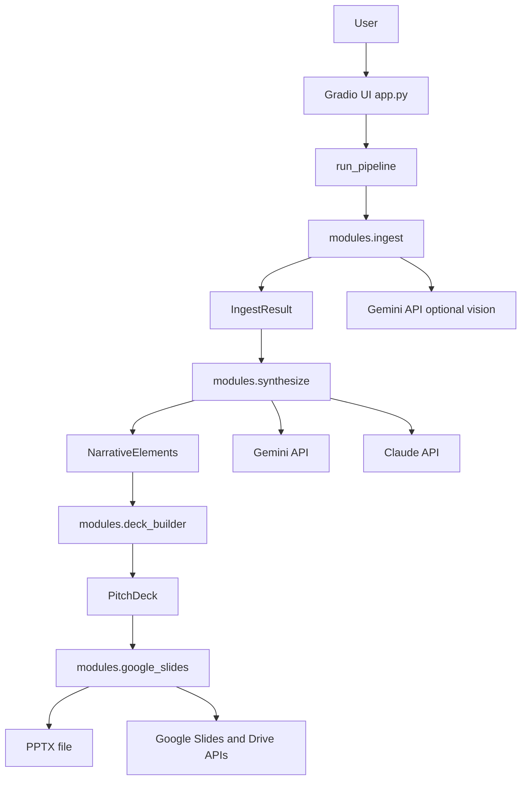

# Pitch Deck Agent architecture

> **Evidence status.** This is derived, replaceable documentation, not canonical project authority; `projects/pitch-deck-agent` remains the authority. The components below are present in tracked source. No tracked test suite was found, so application execution is **runtime unverified**.

The repository contains one Python application rather than a multi-service deployment. `app.py` is the executable boundary: when run as a script it constructs a Gradio `Blocks` UI and launches it on `0.0.0.0:7860`. The button event calls the in-process orchestrator `core.pipeline.run_pipeline`; there are no HTTP route declarations, background-job workers, queues, databases, event consumers, or persistence schemas in the inspected source.

*Tracked-source component and data flow; arrows show calls/data movement, not verified production traffic.*

## Executable and composition boundaries

| Boundary | Owner | Implemented behavior | Scope boundary |
|---|---|---|---|
| Gradio application | `app.py:create_app`, `generate_deck` | Builds upload/settings/result components and registers one `generate_btn.click` handler. | No application REST/RPC routes are defined. |
| Pipeline | `core/pipeline.py:run_pipeline` | Runs ingest, synthesis, deterministic deck building, then one exporter branch. | Synchronous and in process; exceptions are caught into `PipelineResult`. |
| Content intake | `modules/ingest.py` | Reads Gradio-provided local upload paths, validates size/extensions, parses inputs into models. | Uploaded content becomes prompt input; see [ingestion](../ingestion/ingestion.md). |
| Narrative service | `modules/synthesize.py` | Uses Gemini or Claude SDK calls to generate JSON and creates `NarrativeElements`. | Output is model-generated and may contain instructed inference; see [synthesis](../synthesis/narrative-synthesis.md). |
| Presentation service | `modules/deck_builder.py`, `modules/google_slides.py` | Creates slide records then writes PPTX or invokes Google APIs. | No persisted deck record or download store exists. |
| Deployment | `Dockerfile` | Installs requirements, copies source, exposes 7860, runs `python app.py`. | Presence does not prove an image build or deployment. |
| Documentation automation | `.github/workflows/code-map.yml` | Generates and publishes a derived code map. | Separate from this application's runtime; see [operations](../operations/config-and-automation.md). |

## Internal contracts

`core/models.py` is the in-memory contract boundary: `IngestedDocument` aggregates into `IngestResult`; synthesis maps that into `NarrativeElements`; `build_deck` produces `PitchDeck` containing `Slide` objects. `FileType` constrains input classifications and `SlideType` constrains the builder/renderers. `IngestedDocument.has_content` is true only for nonblank extracted text or image descriptions; `IngestResult.combined_text` emits source-attributed document text and descriptions. `PitchDeck.slide_count` is derived from its slide list. `Slide.speaker_notes` and `image_prompt` travel with the model, but exporters do not treat them identically: PPTX writes notes and neither branch materializes `image_prompt`; see [deck construction and exports](../deck/deck-and-exports.md).

These are Pydantic models except `PipelineResult`, which is a plain mutable container. The application does not declare a database model, migration, cache, session model, or job-state store.

The only configuration module, `config.py`, is imported by UI/pipeline/modules. It reads environment variables at module import, creates `tmp` under the repository base directory, and centralizes nominal size/page/extension limits. It is described with operational boundaries in [configuration and automation](../operations/config-and-automation.md).

## Runtime hierarchy

1. `__main__` in `app.py` calls `create_app()` then `app.launch`.
2. A user clicks the bound Gradio button, invoking `generate_deck`.
3. The handler validates a nonempty file list and a selected provider's UI-level key presence, then invokes `run_pipeline`.
4. The pipeline has four ordered stages: ingest, synthesize, build, export.
5. The handler formats `PipelineResult` fields into status text, optional file, narrative Markdown, and optional Slides URL.

The detailed ordering, branch conditions, and failure paths are the canonical wiki treatment in [pipeline runtime](../runtime/pipeline.md). Input parsing has implementation defects and feature mismatches documented in [implementation status](../status/implementation-status.md); do not infer a working upload format from UI labels alone.

## External integrations and trust boundaries

| Provider/dependency | Exact code boundary | Data/capability exposed by source |
|---|---|---|
| Google Gemini | `modules.ingest:_get_gemini`, `_parse_pdf_with_gemini`, `_describe_image_with_gemini`; `modules.synthesize:_synthesize_with_gemini` | Input PDF page images, uploaded image bytes, or aggregated extracted content is sent via `generate_content` when relevant code paths and credentials are available. |
| Anthropic Claude | `modules.synthesize:_synthesize_with_claude` | Aggregated extracted content is sent through `anthropic.Anthropic(...).messages.create`. |
| Google Slides / Drive | `modules.google_slides:_get_slides_service`, `export_to_google_slides` | Service-account credentials create/edit presentations; optional email receives a Drive `writer` permission. |
| Local filesystem | `ingest_from_gradio`, `export_to_pptx`, `config.TEMP_DIR` | Upload wrapper reads paths supplied by Gradio; PPTX branch saves to `tmp`; source does not implement cleanup or isolation. |

No user authentication, authorization, rate limiting, malware scanning, content moderation, tenant isolation, CSRF policy, or authorization policy is implemented in the inspected application source. The Google service account scopes and input validation limits are implementation details, not substitutes for those controls.
