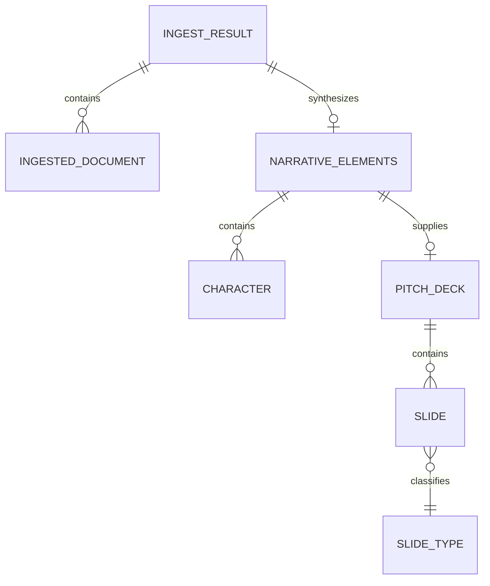

# Deck construction and presentation exports

The deck stage is deterministic after synthesis: `modules.deck_builder:build_deck` maps `NarrativeElements` into a `PitchDeck`; `modules.google_slides` either writes that model to a local PPTX or creates a Google presentation. This page reports tracked implementation, not verified presentation output.

*In-memory model relationships declared in `core/models.py`; synthesis and construction are process steps, not persistence relationships.*

## Model and builder

| Model/symbol | Role |
|---|---|
| `NarrativeElements` | Synthesis output holding story fields plus `Character` list and raw provider response. |
| `PitchDeck` | Deck title, `Slide` list, optional narrative, source-file count, provider label; `slide_count` returns list length. |
| `Slide` | Number, enum type, title/subtitle/body/bullets, speaker notes, and an image prompt field. |
| `SLIDE_FLOW_10` | Fixed order: title, logline, genre/tone, characters, setting, plot, conflict, key scenes, audience/comps, closing. |
| `_build_slide` | Per-type direct field mapping; no additional LLM call. |

`build_deck` takes the prefix `SLIDE_FLOW_10[:slide_count]`, calls `_build_slide` for each, and attaches the original narrative. It does not read `templates/deck_10_slide.json`. The template is present but unconsumed and therefore not the runtime source of slide sequence. The Gradio control allows 6–15; requests above 10 are silently limited by the ten-item sequence. At the UI minimum (6), current source emits title through plot; at 10 it emits every declared type; at 11–15 it still emits the same ten types. A requested count below 1 simply produces an empty prefix under Python slicing; UI bounds are not enforcement for programmatic callers.

### Change contract for the 6–15 UI range

The source does not implement an extended flow, so a deterministic 11–15 strategy is an explicit design/change decision rather than existing behavior. One source-compatible extension rule is: retain the current ordered ten types; append exactly five new enum types in this order—`THEMES`, `VISUAL_STYLE`, `CHARACTER_ARCS`, `MARKET_CASE`, `NEXT_STEPS`; and take the prefix for every requested count from 6 through 15. Under that rule, 11 adds themes, 12 adds visual style, 13 adds character arcs, 14 adds market case, and 15 adds next steps. It is a recommended seam, not a claim that these types exist now.

Each added type needs an explicit `_build_slide` mapping: `THEMES` uses `n.themes` as capped bullets; `VISUAL_STYLE` uses `n.visual_style` as body; `CHARACTER_ARCS` uses capped `n.characters` name/arc lines; `MARKET_CASE` uses `n.target_audience` as subtitle plus capped `n.comparable_titles` bullets; `NEXT_STEPS` must either map a newly added, schema-backed narrative field or use a deliberately fixed renderer string—do not fabricate source-derived content. Each must preserve sequential numbering and the existing `Slide` title/subtitle/body/bullets/notes/image-prompt shape, so both exporters receive a stable model. Choose one executable source of order (Python flow or a runtime-loaded JSON template), not two.

A focused test matrix should construct one complete `NarrativeElements` fixture and assert: 6 returns the first six types; 10 returns the current full flow; each request 11–15 returns the specified prefix and contiguous numbers; every returned slide preserves its mapped fields. Run that deck through mocked Google request generation and temporary-file PPTX generation, asserting both consume each count and all text fields; assert current expected note divergence until parity is deliberately implemented. Also cover `_split_arc` delimiters/three-part labelling and the existing list caps for themes, characters, scenes, and comparables before changing the public slider range.

## PPTX exporter

`export_to_pptx(deck, output_path)` uses `python-pptx`, creates a 13.333 by 7.5 inch blank-layout presentation, and writes a dark background with title/subtitle/body/bullets. It distinguishes title/closing alignment and saves to caller-provided path. It writes `Slide.speaker_notes` into `slide.notes_slide.notes_text_frame.text`. It does not create images from `image_prompt`, apply the named Google layout constants, or sanitize `output_path`.

The pipeline's fallback path creates `tmp/<deck-title-with-space-replacement>_pitch.pptx` relative to the current working directory. This is an artifact path passed back to Gradio, not a persisted domain record.

## Google Slides exporter and authorization boundary

`_get_slides_service` creates service-account credentials from JSON in `GOOGLE_CREDENTIALS_JSON`, otherwise from `GOOGLE_APPLICATION_CREDENTIALS` or `credentials.json`. It passes the `presentations` and `drive.file` scopes defined in config, then builds Slides v1 and Drive v3 clients. No end-user OAuth flow is implemented despite dependencies listed in requirements.

`export_to_google_slides` performs these operations:

1. creates a presentation titled from `deck.title`;
2. uses the provider-created first slide for deck slide 0 and schedules blank Slides for the remainder;
3. accumulates background/text/style requests through title, closing, or standard content layout functions;
4. sends one `batchUpdate` if requests exist;
5. constructs the edit URL; if email is supplied, attempts a Drive permission with role `writer` and notification disabled;
6. returns presentation ID and URL.

The presentation is created before batch update. If a request build/update fails, the pipeline catches the exception but this function does not delete the already-created remote presentation. Sharing exceptions are caught locally and only logged, so the function still returns the edit URL. The caller must not interpret that URL as proof that optional sharing succeeded.

`_add_speaker_notes` constructs requests but is never called during Google request assembly. Thus, contrary to the PPTX branch, Slides speaker notes are not exported by this tracked implementation. Layout functions only emit text/background requests; `Slide.image_prompt` is not sent to an image generator or inserted into either output.

### Cross-export parity and focused validation

Both exporters receive the same `PitchDeck` and attempt to emit title, optional subtitle, optional body, and bullets, but their render contracts differ: Google reuses a provider-created first slide, creates later `BLANK` slides, and applies request-built dark/accent backgrounds plus named fonts; PPTX creates blank-layout slides itself with hard-coded RGB colors and sizes. PPTX writes speaker notes; Google currently does not. Neither path renders images. These are supported differences, not parity. Before claiming parity, add focused tests that inspect a deck with all optional content and assert per-exporter title/subtitle/body/bullets, expected theme/layout requests or PPTX formatting, notes behavior, and the absence or newly added handling of image prompts. Add failure-path tests for Slides creation followed by batch failure and a nonfatal sharing failure.

## Inactive prompt assets and scope boundaries

`prompts/story_synthesis.py` also defines `SLIDE_CONTENT_PROMPT` and `REFINEMENT_PROMPT`. No module imports either constant, and no deck-builder/exporter call uses them. They do not implement slide-content generation or refinement. Likewise, no Canva exporter or separate PPTX module exists in the inspected tracked source. These distinctions matter when changing deck quality: current behavior is direct field mapping plus renderer formatting, not iterative agent editing.

For synthesis field provenance, see [narrative synthesis](../synthesis/narrative-synthesis.md). For pipeline selection/error semantics, see [pipeline runtime](../runtime/pipeline.md), and for limitations requiring repair, see [implementation status](../status/implementation-status.md).
