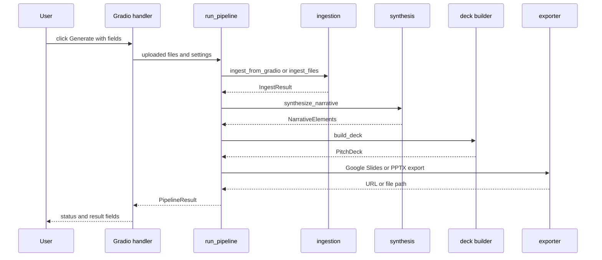

# Generation pipeline runtime

`app.py:generate_deck` is the single visible UI event handler. It accepts Gradio upload objects, output format, requested slide count, synthesis provider, and an optional share email. It returns four values expected by the registered Gradio outputs: summary text, an optional PPTX path, narrative Markdown, and an optional Google Slides link. All behavior is present in tracked source; runtime execution is unverified because no tracked tests were found.

*Ordered calls on the successful path in `run_pipeline`; exceptions or empty ingestion return/fall through as described below.*

## Gradio interaction contract

`create_app` builds one `gr.Blocks` application with a multi-file `gr.File` input, radio controls for `PPTX`/`Google Slides` and `Gemini`/`Claude`, a 6–15 slider, and an optional sharing-email textbox. The visible file filter lists PDF, text/Markdown/RTF, EML/MSG, and common image extensions. It binds the Generate button to `generate_deck` and binds exactly four outputs: a noninteractive status textbox, a file component, narrative Markdown in an accordion, and Markdown for a Slides link. `gr.Progress` is passed to the handler and receives an ingesting message before the pipeline call; no per-stage progress callback crosses into `run_pipeline`.

The handler displays narrative fields and character/scene lists only when `result.narrative` is present; it supplies the returned file path only when `result.output_file` is nonempty and renders a link only when `result.output_url` is nonempty. UI selection is not a complete runtime contract: input-filter/config mismatches, the document dispatch defect, and the ten-slide builder cap are source-visible limitations in [implementation status](../status/implementation-status.md).

## Entry validation versus pipeline validation

`generate_deck` rejects an empty `files` value before calling the pipeline. It also displays an error when the explicitly selected `gemini` or `claude` provider lacks its corresponding environment-backed key. It normalizes output format by lowercasing and replacing spaces with underscores, casts `slide_count` to `int`, lowercases provider, and strips the email.

`run_pipeline` independently accepts either:

- a list whose first item has a `.name` attribute, dispatched to `ingest_from_gradio`; or
- a list whose first item is a `(filename, bytes)` tuple, dispatched to `ingest_files`.

Any other shape produces a `failed` `PipelineResult` with `No valid files provided`. It then fails if `IngestResult.documents` is empty. It carries parser error strings forward but does not stop merely because some files failed.

## Lifecycle and result contract

`PipelineResult` is a plain class—not a Pydantic schema—with intermediate `ingest_result`, `narrative`, `deck`, output URL/file fields, `errors`, and a `status` string. Its `summary` renders all populated fields and joins errors. `run_pipeline` transitions status in this order:

| State | Set by | Next behavior |
|---|---|---|
| `pending` | constructor | Initial value. |
| `ingesting` | before input dispatch | Invalid shape or no extracted documents sets `failed` and returns. |
| `synthesizing` | after nonempty documents | Calls provider selection. |
| `building` | after a narrative returns | Constructs `PitchDeck`, records input count and provider label. |
| `exporting` | after deck construction | Chooses Slides only with exact format and nonempty JSON credential value; otherwise PPTX. |
| `complete` | after exporter returns | Returns populated result. |
| `failed` | early validation or outer exception | Appends error string when the outer `try` catches an exception. |

A synthesis result with an empty logline only logs a warning; it remains eligible for deck construction. Conversely, exceptions from ingest, synthesis, build, or export are caught by the outer `try`, logged through Loguru, placed in `errors`, and result in `failed`.

## Export decision

The Google branch requires both `output_format == "google_slides"` and a nonempty `GOOGLE_CREDENTIALS_JSON`. It calls `export_to_google_slides(deck, share_with_email=share_email or None)` and assigns its returned `url`. Every other case—including a Google Slides UI selection without that JSON value—writes `tmp/<title_with_underscores>_pitch.pptx` via `export_to_pptx`. The `app.py` UI-level provider key checks do not ensure the chosen backend will actually be used: synthesis falls back to Gemini if the requested provider is not `claude` with a Claude key.

See [deck construction and exports](../deck/deck-and-exports.md) for API behavior and artifacts. See [implementation status](../status/implementation-status.md) for the silent ten-slide cap and input paths that may fail before normal processing.

## Change routing

- Change UI fields or presentation of results: `app.py:create_app` and `generate_deck`.
- Change stage ordering, status/error contract, or output selection: `core/pipeline.py:run_pipeline`.
- Change parser/content handling: [ingestion](../ingestion/ingestion.md).
- Change provider integration/structured narrative fields: [synthesis](../synthesis/narrative-synthesis.md).
- Change generated slide content or writing semantics: [deck and exports](../deck/deck-and-exports.md).

There is no committed focused test command. Static source review is the only evidence available in this checkout; any runtime validation must be added and executed separately.
